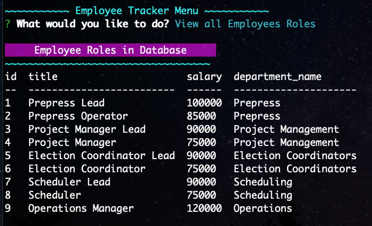
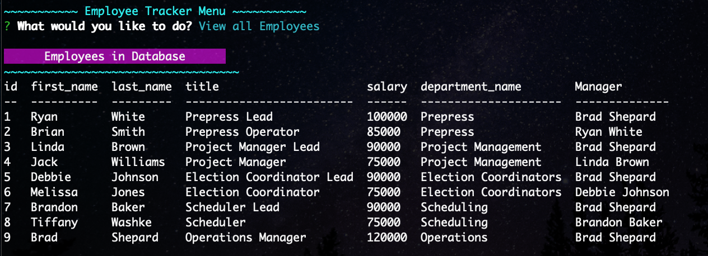

# Employee Tracker

 

## Description

The [Employee Tracker](https://github.com/twashke/Employee-Tracker) is a command line application used to view, add, update and delete Employee information from a MySQL database. Utilizing multiple different npm packages, this application can help the user view Employee information as well as add, update and delete it. A walkthrough demonstrating the applications functionality can be found [here]().

## Table of Contents

- [About the Project](#about-the-project)
- [Installation](#installation)
- [Usage](#usage)
- [Contributing](#contributing)
- [Tests](#tests)
- [License](#license)
- [Questions](#questions)

## About the Project

- View Departments, Employee Roles, All Employees, Employees by Manager, and Total Utilized Budget of Each Department.
- Add Departments, Employee Roles, and Employees.
- Update Employee Roles and Employee Managers.
- Delete Departments, Employee Roles, and Employees.
- This application utilizes the following npm packages:
  - [dotenv](https://www.npmjs.com/package/dotenv)
  - [console.table](https://www.npmjs.com/package/console.table)
  - [chalk](https://www.npmjs.com/package/chalk)
  - [figlet](https://www.npmjs.com/package/figlet)
  - [inquirer](https://www.npmjs.com/package/inquirer)
  - [mysql](https://www.npmjs.com/package/mysql)
  - [nodemon](https://www.npmjs.com/package/nodemon)

## Installation

- **git clone** from [Employee Tracker](https://github.com/twashke/Employee-Tracker)
- **npm install** (to install dependencies)
- **Update** the [.env.Example](.env.EXAMPLE) file with **MYSQL password**
- Use the [schema.sql](db/schema.sql) file to load the database and tables
- In MySQL Database, use the [seeds.sql](db/seeds.sql) to seed the database with employees (or create your own)
- **npm start**

## Usage

- View the [Employee Tracker Walkthrough]() for how to use this application.

View Departments \

View Employee Roles \

View All Employees \

View Employees by Manager \

View Total Utilized Budget of each Department \

Add Departments \

Add Employee Roles \

Add Employees \

Update Employee Roles \

Update Employee Managers \

Delete Departments \

Delete Employee Roles \

Delete Employees \

Exit \

## Contributing

- No contributions made to this project.

## Tests

- Testing throughout project to ensure application is working as intended.

## License

This application is covered by the [MIT License](https://opensource.org/licenses/MIT).

      Copyright 2021 Tiffany Washke

      Permission is hereby granted, free of charge, to any person obtaining a copy of this software and associated documentation files (the "Software"), to deal in the Software without restriction, including without limitation the rights to use, copy, modify, merge, publish, distribute, sublicense, and/or sell copies of the Software, and to permit persons to whom the Software is furnished to do so, subject to the following conditions:

      The above copyright notice and this permission notice shall be included in all copies or substantial portions of the Software.

      THE SOFTWARE IS PROVIDED "AS IS", WITHOUT WARRANTY OF ANY KIND, EXPRESS OR IMPLIED, INCLUDING BUT NOT LIMITED TO THE WARRANTIES OF MERCHANTABILITY, FITNESS FOR A PARTICULAR PURPOSE AND NONINFRINGEMENT. IN NO EVENT SHALL THE AUTHORS OR COPYRIGHT HOLDERS BE LIABLE FOR ANY CLAIM, DAMAGES OR OTHER LIABILITY, WHETHER IN AN ACTION OF CONTRACT, TORT OR OTHERWISE, ARISING FROM, OUT OF OR IN CONNECTION WITH THE SOFTWARE OR THE USE OR OTHER DEALINGS IN THE SOFTWARE.

## Questions

**Contact Tiffany Washke**

- **Email directly at** twashke@gmail.com
- **GitHub User Name:** [twashke](https://github.com/twashke)

